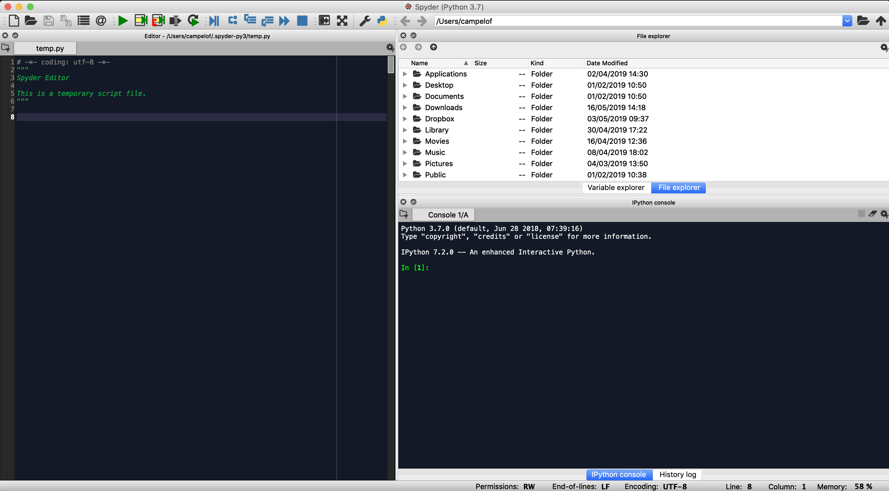
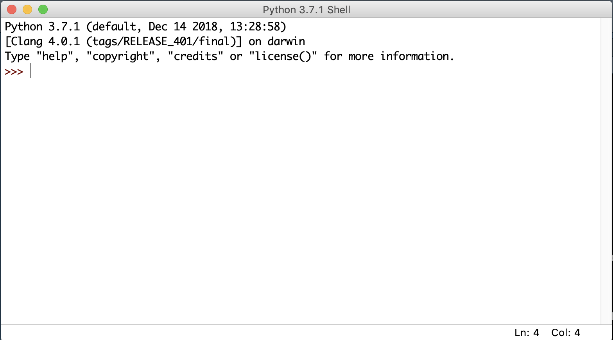
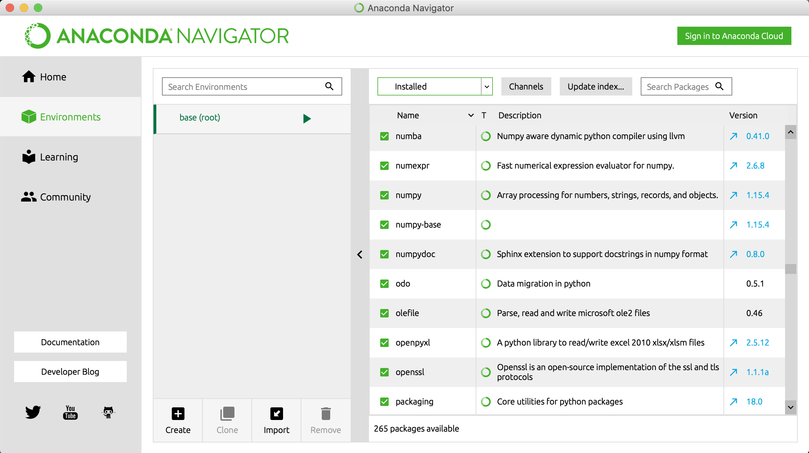

```{r,echo=FALSE}
set.seed(42)
options(digits = 3)
knitr::opts_chunk$set(
  comment = "#>",
  collapse = TRUE,
  cache = TRUE,
  out.width = "60%",
  fig.align = 'center',
  fig.asp = 0.618,  # 1 / phi
  fig.show = "hold"
)

options(dplyr.print_min = 6, dplyr.print_max = 6)
```

## Overview
- Introduction to Python
- Anaconda
- Basic programming
  <br><br>
- Acknowledgments
  - Some of the examples in this unit are taken from: [Python Crash Course - A Hands-on, Project-based, introduction to programming](https://www.amazon.co.uk/Python-Crash-Course-Hands-Project-Based/dp/1593276036)
  - This unit was created with the immense help of [Mr. Jomar Alcantara](https://github.com/joealcantara/) from Aston University, UK.
  
## Why Python?
- According to a [2013 survey](https://www.oreilly.com/ideas/2013-data-science-salary-survey) by learning company O'Reilly, 40 percent of data scientists responding use Python in their day-to-day work.
- These data scientists are not alone - actually they are part of a legion of programmers in all fields of knowledge, who have made Python one of the top ten most popular programming languages in the world every year since 2003.
- Organizations such as Google, NASA, and CERN use Python for almost every programming purpose under the sun - including, in increasing measures, data science.

## Why Python?
- According to StackOverflow's [2019 Developer Survey](https://insights.stackoverflow.com/survey/2019) the top 5 most wanted languages in 2019 are:
  * Python: 25.7%
  * JavaScript: 17.8%
  * Go: 15.0%
  * TypeScript: 14.6%
  * Kotlin: 11.1%
- The top most wanted languages are nearly identical to last year’s report.
- Pyhton also features prominently as the second most loved language.

## Python vs R
- Being two of the most widely used languages for data science (see [here](https://medium.com/datadriveninvestor/top-6-data-science-programming-languages-for-2019-39ba1b6819a8) and [here](https://bigdata-madesimple.com/top-8-programming-languages-every-data-scientist-should-master-in-2019/)), it is natural to compare Python vs. R in terms of their capabilities and limitations.
- We've already covered some of the capabilities offered by R, but there are a few more that need mentioning.

## R
- Academics and statisticians have developed R over two decades. R has now one of the richest ecosystems to perform data analysis.
- There are around 12000 packages available in CRAN (and growing by the day). It is possible to find a library for whatever the analysis you want to perform. 
- The rich variety of library makes R the first choice for statistical analysis, especially for specialized analytical work.

## R
- The cutting-edge difference between R and the other statistical products is the output. R (and RStudio in particular) has fantastic tools to communicate the results of data analysis.
- Rstudio offers full integration with the **knitr** package, which makes reporting and reproducible research trivial and elegant.
- Communicating the findings with a presentation or a document is easy (the material you're reading now, for instance, is generated with **knitr**)

## R
- Advantages
  * Excellent graphical capabilities
  * Large catalog for data analysis
  * Github interface
  * RMarkdown
  * Shiny
  * A language designed for statistical analysis and data science

- Disadvantages
  * Slow 
  * Learning curve from hell
  * Dependencies between libraries
  
## Python
- Python can do pretty much the same tasks as R: data wrangling, feature engineering, web scrapping, and so on. 
- Python is a tool to deploy and implement machine learning at a large-scale. 
- Codes are easier to maintain and generally considered more robust than R. 
- Originally, Python didn't have many data analysis and machine learning libraries. Recently, however, it has been catching up, and provides cutting-edge API for machine learning or Artificial Intelligence. 

## Python
- Most data science tasks can be executed with five Python libraries: **Numpy**, **Pandas**, **Scipy**, **Scikit-learn** and **Seaborn**.
- Python is designed for replicability and accessibility. If you need to use the results of your analysis in an application or website, Python tends to be the best choice.

## Python
- Advantages
  * Jupyter notebook: Notebooks help to share data with colleagues
  * Mathematical computation
  * Deployment
  * Code Readability
  * Speed
  * A general purpose programming language

- Disadvantages
  * Not as many libraries as R

- The main differences and similarities between the syntax and outputs of R and Python are discussed [here](https://www.dataquest.io/blog/python-vs-r/).

## Python versions
- There are currently two different supported versions of Python, 2.7 and 3.7.
- Historically, 2.7 used to be the version of choice for Data Scientists. 
  - Mainly due to more stable versions of packages such as **Numpy**, **Pandas** and **Scikit-learn**. 
- However, as time has gone on Python 3 has been adopted as the version to use for all things data science.
- Python 2 is now considered a legacy version of the programming language and is due to be retired (read: not actively maintained) on January 1, 2020.

## Python versions
- Somewhat atypical of updates to programming languages, Python 3 introduced many backwards-incompatible changes to the language, so code written for 2.7 may not work under the latest versions of Python and vice versa. For this module all code will use Python 3.7.
  - You can check your Python version at the command line by running `python --version`.
  
## Anaconda Python
- While there are several different distributions of Python, we will use the **Anaconda** distribution
  - makes package maintenance and code deployment easier
- The _Anaconda Navigator_ offers, by default, a wide variety of applications, including:
  - JupyterLab and Jupyter Notebook
  - Spyder
- It also makes it very simple to lauch RStudio or Visual Tools.

## Installing Python
- Python installation is generally simple. You can find detailed instructions online at:
  - Windows:<font size=4> [https://docs.anaconda.com/anaconda/install/windows/](https://docs.anaconda.com/anaconda/install/windows/)</font>
  - Mac: <font size=4>[https://docs.anaconda.com/anaconda/install/mac-os/](https://docs.anaconda.com/anaconda/install/mac-os/)</font>
  - Linux: <font size=4>[https://docs.anaconda.com/anaconda/install/linux/](https://docs.anaconda.com/anaconda/install/linux/)</font>

- To verify your installation, please check   
<font size=4>[https://docs.anaconda.com/anaconda/install/verify-install/](https://docs.anaconda.com/anaconda/install/verify-install/)</font>

## Launching Anaconda Navigator
- Windows: from your Windows Start menu, select the shortcut _Anaconda Navigator_ (should be in the "Recently added"; if not, just type "_Anaconda Navigator_").
- Mac or Linux: open a terminal window and type `anaconda-navigator`.
- Mac-only: from the _Applications_ folder, click the alias for _Anaconda Navigator_. 
  - If you want to add a shortcut to the Dock you need to use the original application (usually located under `~\anaconda3`)
  
## Anaconda Navigator
- Anaconda Navigator is a laucher for several different Python (and R!) development environments.

<p align="center"></img></p>

## Using Spyder

- **Spyder** is a powerful interactive development environment for Python, with advanced editing, interactive testing, and debugging features. 
- The homepage for Spyder is [https://www.spyder-ide.org/](https://www.spyder-ide.org/) but if you installed Python using Anaconda, then it should be part of the installation process.
- The name SPYDER derives from "Scientific PYthon Development EnviRonment" (SPYDER).
- It can be used as the main environment to learn about Python, programming and computational science and engineering. 
- Layout and features are similar to RStudio.

## Using Spyder
- Useful features include
  * provision of the IPython (Qt) console as an interactive prompt, which can display plots inline
  * ability to execute snippets of code from the editor in the console
  * continuous parsing of files in editor, and provision of visual warnings about potential errors
  * step-by-step execution
  * variable explorer similar to RStudio

## Using Spyder
<p align="center"></img></p>


## Using Jupyter Notebooks
- The Jupyter Notebook is an open source web application that you can use to create and share documents that contain live code, equations, visualizations, and text. Jupyter Notebook is maintained by the people at [Project Jupyter](https://jupyter.org/).
- Jupyter Notebooks are a spin-off project from the [IPython project](https://ipython.org/), which used to have an IPython Notebook project itself. The name _Jupyter_ comes from the core supported programming languages that it supports: **Julia**, **Python**, and **R**.
- Jupyter ships with the IPython kernel, which allows you to write your programs in Python, but there are currently over 100 other kernels that you can also use.
- If you installed Python using Anaconda, then it's likely that the Jupyter Notebook package was installed as part of this. If it wasn't, just type `conda install jupyter` on the terminal.

## Using IDLE
- IDLE is the standard Python development environment. Its name is an acronym of "Integrated DeveLopment Environment". It works well on both Unix-based (including Mac OS and, of course, Linux) and Windows platforms.
- It has a Python shell window, which gives you access to the Python interactive mode. It also has a file editor that lets you create and edit existing Python source files.
- You can type Python code directly into this shell, at the '>>>' prompt. Whenever you enter a complete code fragment, it will be executed.
- Just type `IDLE3` in the terminal to start an IDLE session using Python 3.X

## Using IDLE
<p align="center"></img></p>


## Modules
- Modules are the Python counterparts to R packages: pre-defined libraries which add additional functionality to base Python installation.
- In order to have access to these libraries they need to be installed. When you install Anaconda several come by default, but it is important to know how to install them.

## Installing modules using Anaconda
- To install a module using Anaconda, just type `conda install package-name` in the terminal. 
- To install a specific version of a module using Anaconda, open the terminal and type e.g.<br>
`conda install package-name=2.3.4` 
- To list all packages installed using conda, just type `conda list`
- Alternatively, Anaconda Navigator provides the "environments" tab where you can check all installed modules, install new modules, update/remove existing ones etc.

## Installing modules using Anaconda
<p align="center"></img></p>

## Using Pip instead of Conda
- If you're a purist, you may prefer not to use Anaconda and instead use a basic installation of Python. If this is the case, your main way for installing packages is using **Pip**. 
- To install a module using Pip, open the terminal and type the same commands used for Anaconda, just replacing `conda` by `pip`.

## The modules of this module
- In this module we will be concentrating on some of the main modules used for data science-related activities:
  - **pandas**, for data wrangling and manipulation
  - **numpy**, for numerical processing and specific data types
  - **matplotlib**, for data visualisation
  - **sklearn**, for modelling
- To access the functionalities of any of these modules when we use Python, we just use, e.g., `import pandas`
- Since we need to explicitly declare the module of a given function when it is used in Python, it is very common to import modules using aliases. For instance,<br>
`import pandas as pd`

## Some Extra Resources
- Python 3.7 Tutorial: [https://docs.python.org/3/tutorial/](https://docs.python.org/3/tutorial/)
- The Python Data Science Handbook (free online version): [https://jakevdp.github.io/PythonDataScienceHandbook/](https://jakevdp.github.io/PythonDataScienceHandbook/)
- Book: [Fluent Python](https://www.amazon.co.uk/Fluent-Python-Luciano-Ramalho/dp/1491946008)
- Book: [Python Crash Course - A Hands-on, Project-based, introduction to programming](https://www.amazon.co.uk/Python-Crash-Course-Hands-Project-Based/dp/1593276036)